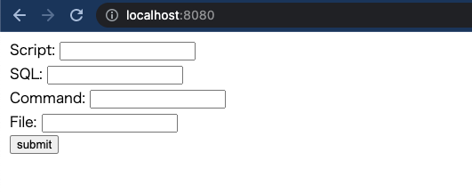

# Sneaker

## Overview

Sneaker is a sample application for vulnerability detection with Snyk.

For more information about Snyk, please refer to the link below.  
https://snyk.io/

## Getting Started

Copy `.env.sample` to create `.env`.

```shell
cp .env.sample .env
```

Install dependencies in the project.

```shell
docker-compose run composer install
```

Start up docker containers.

```shell
docker-compose up
```

Go to http://localhost:8080 with a web browser.



## License

Sneaker is released under the MIT License, see MIT-LICENSE.txt.

